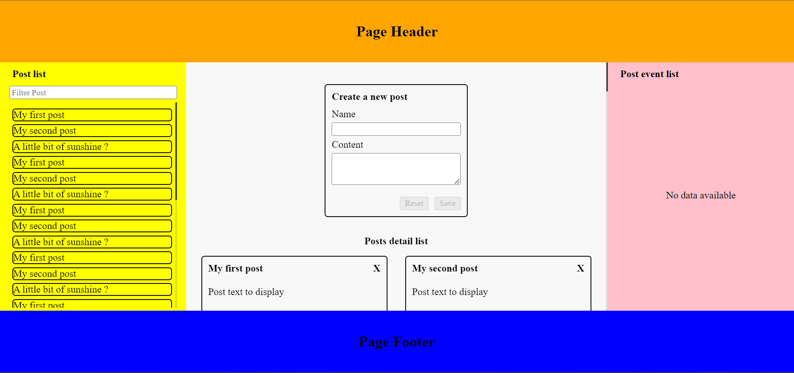

# Akur8
## Please Read this before Running the Project

### Steps involved in running this project
    1.) npm i - to install all the dependancies
    2.) npm i -g npx - install npx as global dependancy
    3.) npm run serve - custom command i have created for serving, if u havent worked with
    Nx workspaces before
    4.) npm run build

## Demo Image Path
./apps/posts/src/assets/post.png
    
    

